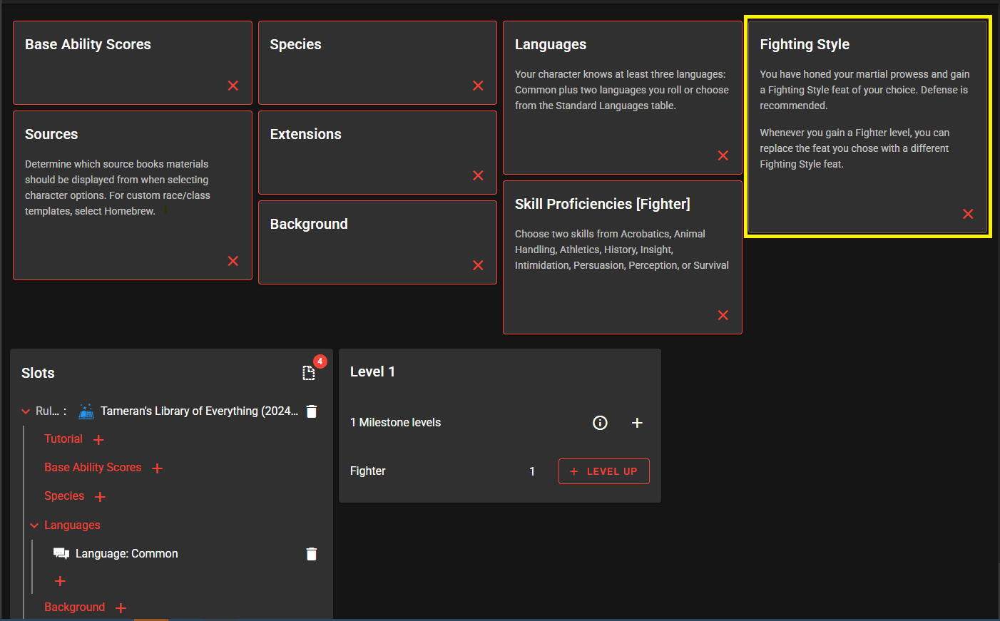
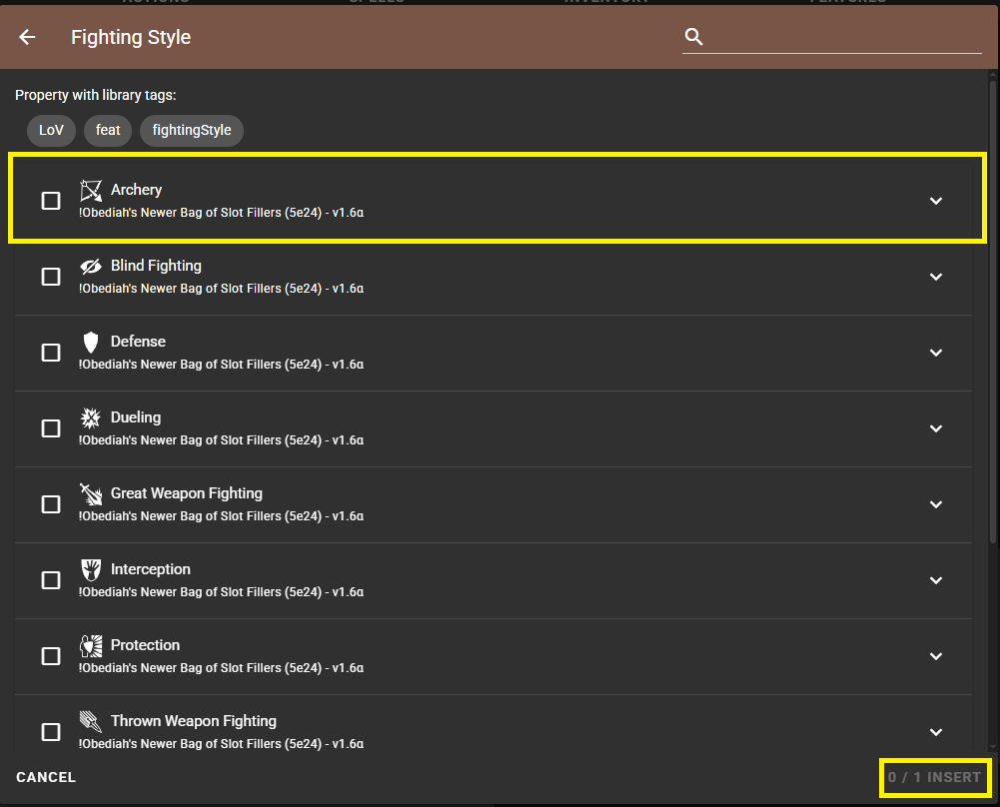

# DiceCloud Tutorial by DnD-K

# 1. Membuat Akun DiceCloud

# 2. Membuka Tab Libraries

# 3. **Subscribe Libraries of Vexus (5e2024)**

# **4. Apa itu Libraries of Vexus?**

# **5. Jangan Campur Rules 2014 & 2024**

# **6. Membuat Character**

# **7. Cek Apakah Library Berhasil**

# 8. Pada tab 'BUILD'

## 1. Sources

Klik Sources -> Check (Centang i) "# Bundle Core Sourcebooks (2024)", "# Bundle: Additional Character Options (2024)", & "# Bundle: Setting Supplements (2024)" -> Klik Insert

## 2. Base Ability Scores

Untuk Base Ability Score silahkan pilih Standart array kemudian akan muncul deretan angka yang harus kalian bagikan ke statistik karakter kalian dimana ada Strength, Dexterity, Constitution, Intelligence, Wisdom dan Charisma

## 3. Species

Species adalah ras kalian. setiap ras memiliki kemampuannya masing-masing dan beberapa memiliki variannya lagi sperti contoh di bawah adalah Dragonborn dimana harus memilih draconic ancestry.

## 4. Background

Background adalah asal muasal kalian atau siapa kalian sebelumnya. Tergantung apa yang kalian pilih, kalian akan mendapatkan Equipment atau kemampuan bawaan yang berbeda, seperti yang bisa kalian liaht dibawah.

## 5. Starting Class

Starting Class adalah Class yang kalian pilih ketika memulai petualangan, dimana apa yang didapatkan akan berbeda jika kalian memilih classnya tidak lvl satu karena kalian tidak akan mendapat starting equipment dari class tersebut.
class secara dasar dibagi menjadi 3 yaitu Martial, Caster dan Half Caster sebagaimana dijelaskan lebih lengkap dibawah.

### 1. Martial

### 2. Caster

### 3. Half-Caster

## 6. Languages

## 7. Extentions - IGNORE !!!