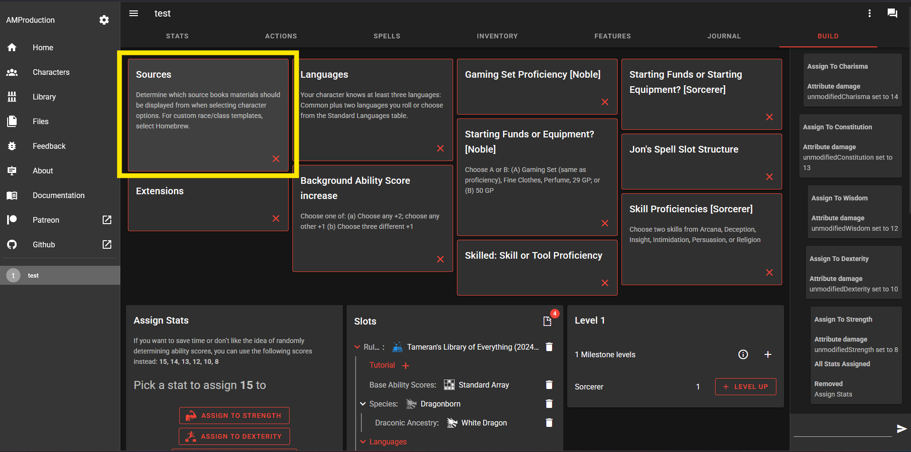
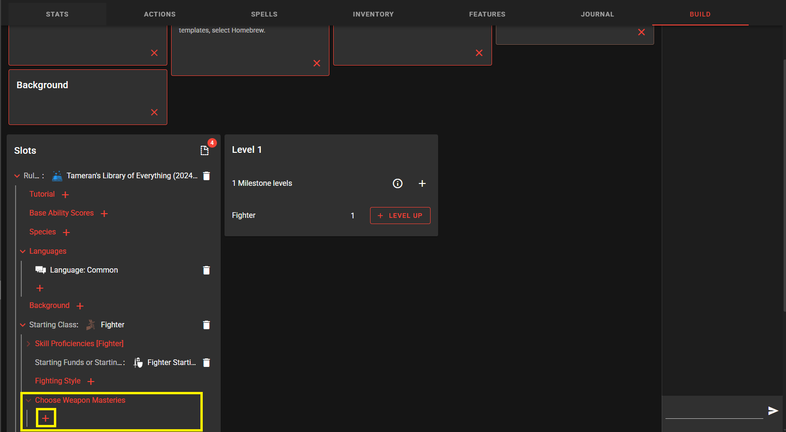
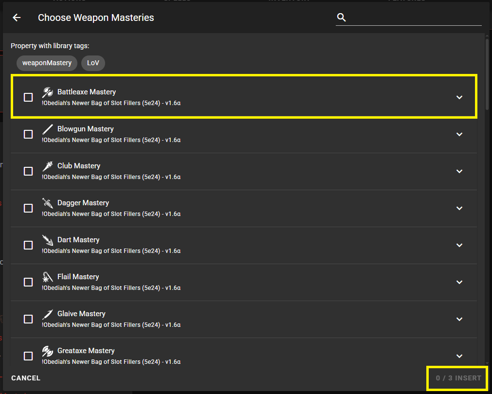
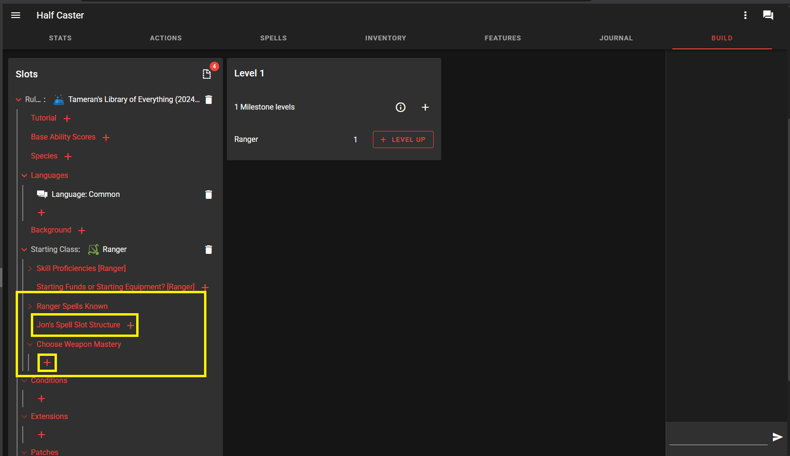

# DiceCloud Tutorial by DnD-K

# 1. Membuat Akun DiceCloud
pertama buka www.dicecloud.com maka akan muncul tampilan seperti ini. jika sudah punya akunya silahkan login, jika belum silahkan daftar menggunakan gmail agar lebih mudah dan ikuti panduannya. 
![[Screenshot 2026-09-06 203707.png]]

![[Screenshot 2026-09-06 210343.png]]
Kemudian jika sudah login silahkan klik tab Library dan cari Libraries of Vexus (5e2024) dan klik subscribe. maka semua content standar untuk 2024 akan otomatis tertambah ke library kalian. Perlu di ingat kita hanya memakai yang 2024 jadi hanya subscribe yang Libraries of Vexus (5e2024) jangan campur dengan Libraries of Vexus (5e2014)
![[Screenshot 2026-09-06 211840.png]]

![[Screenshot 2026-09-06 213006.png]]
# 

# 2. Membuat Character
Klik tab Character maka nanti tampilannya akan seperti gambar dibawah yang menunjukan karakter yang telah kalian buat. Selanjutnya silahkan klik tombol plus di pojok kanan bawah.
![[Screenshot 2026-09-07 215130.png]]

Selanjutnya silahkan isi Field sesuai dengan nama fieldnya. 
![[Screenshot 2026-09-07 215828.png]]
Jika di bagian Biography sudah terisi semua klik Next. Jika kalian sudah mensubscribe Libraries of Vexus (5e2024) maka library tersebut akan muncul di list seperti gambar dibawah. Lalu centang Libraries of Vexus (5e2024) dan kemudian klik CREATE. 
![[Screenshot 2026-09-07 215850 1.png]]
 Kemudian tampilannya akan seperti dibawah ini. 
## 1. Sources

Klik Sources -> Check (Centang i) "# Bundle Core Sourcebooks (2024)", "# Bundle: Additional Character Options (2024)", & "# Bundle: Setting Supplements (2024)" -> Klik Insert

## 2. Base Ability Scores

Untuk Base Ability Score silahkan pilih Standart array kemudian akan muncul deretan angka yang harus kalian bagikan ke statistik karakter kalian dimana ada Strength, Dexterity, Constitution, Intelligence, Wisdom dan Charisma

## 3. Species

Species adalah ras kalian. setiap ras memiliki kemampuannya masing-masing dan beberapa memiliki variannya lagi sperti contoh di bawah adalah Dragonborn dimana harus memilih draconic ancestry.

## 4. Background

Background adalah asal muasal kalian atau siapa kalian sebelumnya. Tergantung apa yang kalian pilih, kalian akan mendapatkan Equipment atau kemampuan bawaan yang berbeda, seperti yang bisa kalian liaht dibawah.

## 5. Starting Class

Starting Class adalah Class yang kalian pilih ketika memulai petualangan, dimana apa yang didapatkan akan berbeda jika kalian memilih classnya tidak lvl satu karena kalian tidak akan mendapat starting equipment dari class tersebut.
class secara dasar dibagi menjadi 3 yaitu Martial, Caster dan Half Caster sebagaimana dijelaskan lebih lengkap dibawah.

### 1. Martial
Martial Class adalah class yang berfokus ke dalam penggunaan senjata seperti Barbarian. Fighter, Rogue dan Monk. Selain mendapatkan Feture classnya masing-masing, martial class akan mendapatkan feature Weapon Masteries sebagaimana ditunjukan dibawah(Kasus khusus untuk Monk).

### 2. Caster
Caster Class adalah class yang berfokus ke penggunaan mantra, entah itu serangan, buff ataupun debuff. Dalam Dungeon's & Dragon's mantra dibagi berdasarkan lvl, yaitu lvl 0 sampai 9. Mantra lvl 0 disebut sebagai cantrip karena mantra ini bisa digunakan secara terus menerus tanpa bayaran spell slot. Nah mantra lvl 1-9 untuk kita bisa merapalnya itu ditentukan oleh seberapa banyak spell slot yang kita miliki. 
Sebagai contoh, seorang Wizard lvl 3 memiliki spell slot lvl 1 sebanyak 4 dan spell slot lvl 2 sebanyak 2. Artinya dia bisa merapal mantra lvl 1 sebanyak 4 kali dan mantra lvl 2 sebanyak 2 kali. 
untuk penggunaan mantra lebih detail akan dijelaskan seiring waktu jadi silahkan tambahkan Jon's Spell Slot Structure.

bagi Caster, banyaknya mantra yang diketahui terbatas jumlahnya dan hanya bisa bertambah ketika naik lvl (Kasus khusus untuk wizard). Sebagaimana seperti ditunjukan dibawah, kalian memilih cantrip dan mantra yang akan karakter kalian gunakan nanti sejumlah yang sudah ditentukan. (Kasus khusus untuk wizard)
![[Screenshot 2026-09-03 111510.png]]

![[Screenshot 2026-09-03 112533.png]]

### 3. Half-Caster
Half-Caster adalah class yang bisa keduanya, meraplakn mantra dan menggunakan senjata. Namun dengan kelebihan tersebut terdapat juga kekurangannya seperti seperti perkembangan spell slot mereka tiap lvl lebih lambat daripada Caster

## 6. Languages
Karena berbagai Species/Ras yang ada di D&D terdapat juga berbagai macam bahasa yang kalian pilih sebagaiamana ditunjukan di bawah.
![[Screenshot 2026-09-03 115023.png]]

![[Screenshot 2026-09-03 115049.png]]
## Jika sudah selesai maka karakter kalian kurang lebih akan seperti ini.
Sekarang tinggal membuat character sheet kalian bisa dilihat oleh orang lain. klik tombol titik 3 di pojok kanan atas dan pilih sharing.
![[Screenshot 2026-09-07 225221 2.png]]
Selanjutnya pilih anyone with the link dan klik DONE. Sekarang siapapun yang punya link ke character kalian, bisa melihat character kalian. 
![[Screenshot 2026-09-07 225957 6.png]]